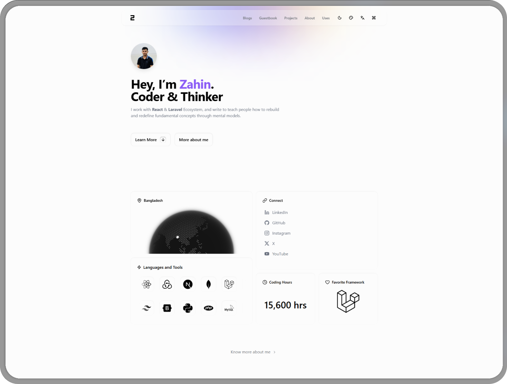
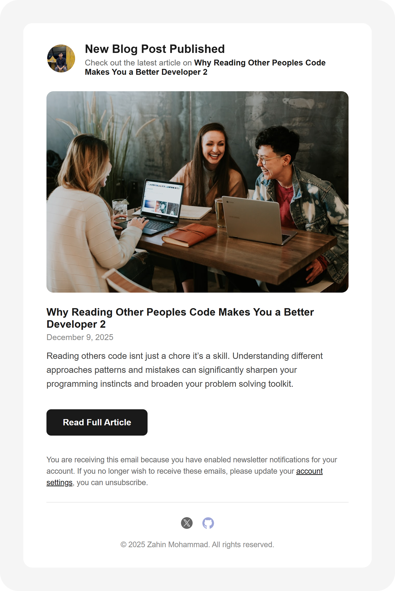
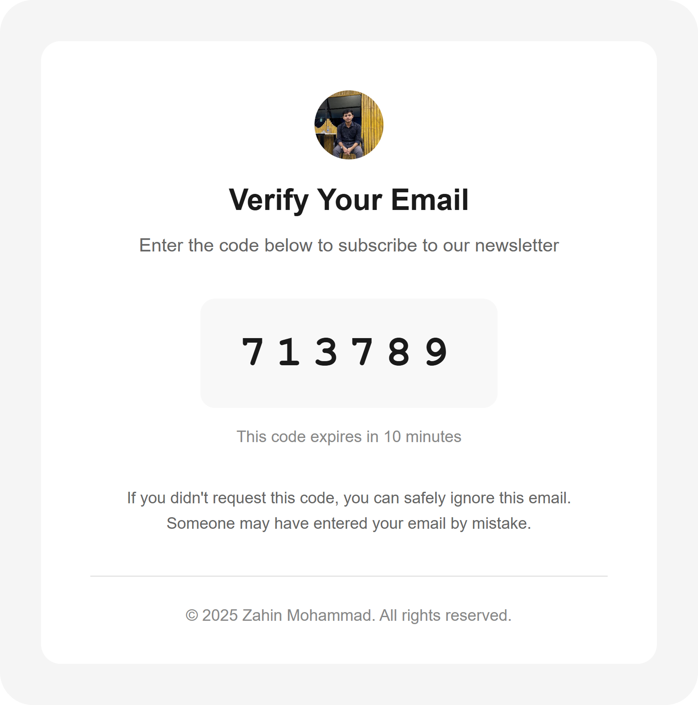

<div align="center">
  <a href="https://isherezahin.vercel.app?ref=https://github.com/IsHereZahin/isherezahin.me">
    <picture>
      <source media="(prefers-color-scheme: dark)" srcset="public/assets/images/web/dark.png">
      
    </picture>
  </a> 

  <h1 align="center">isherezahin.me</h1> 

  
  
  
</div> 

A modern, full-featured personal portfolio and blog platform built with Next.js 16. Features a complete content management system, real-time chat, GitHub Discussions integration, and comprehensive analytics.

## Features

### Blog Module
- Create, edit, and publish blog posts with markdown support
- Tag-based filtering and categorization
- Full-text search functionality
- Like system for blog posts
- Auto-generated table of contents
- Infinite scroll for seamless content loading
- Comment notifications via email

<!--  -->

---

### Project Module
- Portfolio project showcase with images and descriptions
- Tag-based filtering and search
- Like system for projects
- Cloudinary integration for image optimization

<!--  -->

---

### Content Pages
- **Home** - Hero section, featured blogs, projects, and testimonials
- **About** - Personal bio, tech stack, coding hours, location, and work experience
- **Uses** - Tools and technologies used
- **Side Quests** - Personal projects and hobbies
- **Bucket List** - Goals and aspirations
- **Guestbook** - GitHub Discussions-powered guestbook with reactions
- **Attribution** - Credits and acknowledgments
- **Legal** - Privacy Policy and Terms of Service

<!--  -->

---

### Live Chat Module (Firebase Realtime Database)
- Real-time direct messaging
- Typing indicators
- Online/offline presence status
- Admin chat interface

<!--  -->

---

### User Session Module
- Multi-provider OAuth (GitHub & Google) via NextAuth.js v5
- Session management across devices
- User profiles with bio and avatar customization
- Admin role system with protected routes
- User banning capabilities

<!--  -->

---

### Statistics Module
- Visitor tracking (page views & unique visitors)
- Device analytics (Android, iOS, Windows, macOS, Linux)
- Referral source tracking
- Popular pages analytics
- 30-day visitor trends with charts
- Privacy controls for public/private visibility

<!--  -->

---

### Admin Settings Module
- **Content Management** - Add, edit, delete blogs and projects
- **User Management** - View, ban/unban users
- **Subscriber Management** - Newsletter subscribers list
- **Chat Management** - Admin chat interface
- **Statistics Settings** - Toggle visibility of analytics sections
- **Site Settings** - Contact info, about page, work experience configuration

<!--  -->

---

### Email Templates

#### Blog Mail

<div align="center">
  
</div>

#### Subscription OTP Mail

<div align="center">
  
</div>

---

### UI/UX Features
- Built with **shadcn/ui** component library
- Light/Dark mode with system preference detection
- Theme color picker for customizable accent colors
- Responsive mobile-first design
- Smooth animations powered by Framer Motion
- Click-to-zoom images with blur effect
- Command palette for quick navigation

---

### Security & API Protection
This application implements role-based access control with secure API responses:

- **Admin APIs** - Protected endpoints accessible only to authenticated admin users
- **User APIs** - Authenticated user endpoints with session validation
- **Public APIs** - Open endpoints with rate limiting and validation
- **Role-based middleware** - Automatic request filtering based on user roles
- **Session verification** - All protected routes verify session tokens via NextAuth.js
- **Banned user handling** - Blocked users are automatically denied API access

## Tech Stack

| Category | Technologies |
|----------|-------------|
| Framework | Next.js 16, React 19 |
| Language | TypeScript |
| Styling | Tailwind CSS 4, tw-animate-css |
| Database | MongoDB, Mongoose |
| Authentication | NextAuth.js v5 (GitHub, Google OAuth) |
| State Management | React Query (TanStack Query) |
| Forms | React Hook Form, Zod validation |
| UI Components | shadcn/ui, Radix UI, Lucide Icons |
| Charts | Recharts |
| Animations | Framer Motion |
| Image Upload | Cloudinary |
| Email | Nodemailer (SMTP) |
| Drag & Drop | dnd-kit |

## Getting Started

### Prerequisites
- Node.js 18 or higher
- MongoDB database
- GitHub OAuth App (for authentication)
- Google OAuth credentials (optional)
- Cloudinary account (for image uploads)
- SMTP credentials (for newsletter)
- Firebase account (for admin–user live chat)

### Installation

1. Clone the repository:
   ```bash
   git clone https://github.com/isherezahin/isherezahin.me
   cd isherezahin.me
   ```

2. Install dependencies:
   ```bash
   npm install
   ```

3. Configure environment variables:
   ```bash
   cp .env.example .env
   ```

4. Update `.env` with your credentials

5. Update `src/config/seo.config.ts` with your own data before publishing the site.

6. Run the development server:
   ```bash
   npm run dev
   ```

6. Open [http://localhost:3000](http://localhost:3000) in your browser.

### Scripts

| Command | Description |
|---------|-------------|
| `npm run dev` | Start development server with Turbopack |
| `npm run build` | Build for production |
| `npm run start` | Start production server |
| `npm run lint` | Run ESLint |

## Project Structure

```
src/
├── app/                    # Next.js App Router
│   ├── (main)/            # Public routes
│   │   ├── about/         # About page
│   │   ├── admin/         # Admin panel
│   │   ├── blogs/         # Blog listing and details
│   │   ├── guestbook/     # Guestbook page
│   │   ├── profile/       # User profile pages
│   │   ├── projects/      # Project showcase
│   │   ├── statistics/    # Analytics dashboard
│   │   └── ...
│   └── api/               # API routes
├── components/            # React components
│   ├── admin/            # Admin-specific components
│   ├── auth/             # Authentication components
│   ├── chat/             # Chat system components
│   ├── content/          # Content display components
│   ├── home/             # Homepage sections
│   ├── layouts/          # Layout components
│   ├── pages/            # Page-level components
│   └── ui/               # Reusable UI components
├── database/             # MongoDB models and services
├── lib/                  # Utilities and helpers
└── providers/            # React context providers
```

## Contributing

Contributions are welcome! Please feel free to open an issue or submit a pull request. All contributions should adhere to the project's code of conduct.

## Author

**Zahin** – [GitHub Profile](https://github.com/isherezahin)

## Support

If you find this project valuable, consider [becoming a sponsor](https://github.com/sponsors/isherezahin).

## License

This project is licensed under the [MIT License](LICENSE).

---

<div align="center">

### Star & Fork

If you find this project useful, please consider giving it a **star** and **fork** to stay updated with the latest features and improvements!

[](https://github.com/isherezahin/isherezahin.me/stargazers)
[](https://github.com/isherezahin/isherezahin.me/fork)

</div>

<p align="center">
Built with <strong>TypeScript</strong>, <strong>React</strong>, <strong>Tailwind CSS</strong>, and <strong>Next.js</strong> 💚 Crafted in Bangladesh
</p>
